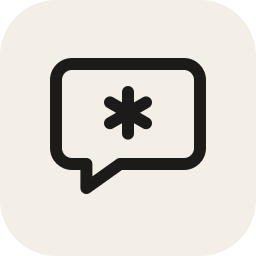
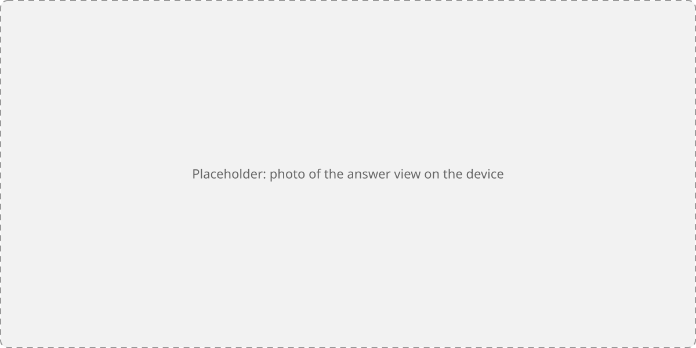
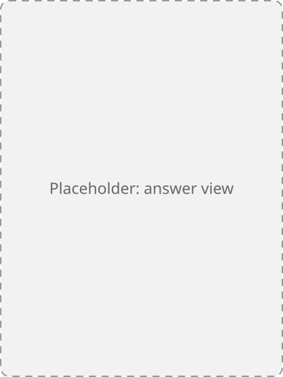

<p align="center">
  
</p>

<h1 align="center">NickleGPT</h1>

<p align="center">
  Ask about the book you're reading on your Kobo, without spoilers.<br>
  A <a href="https://github.com/pgaskin/NickelHook">NickelHook</a> plugin that works with your ChatGPT plan.
</p>

<p align="center">
  <a href="https://github.com/NahuelAlcaide/NickleGPT/actions/workflows/build.yml"></a>
  <a href="https://github.com/NahuelAlcaide/NickleGPT/releases/latest"></a>
  <a href="LICENSE"></a>
</p>

<p align="center">
  
</p>

> [!WARNING]
> NickleGPT patches Kobo's reading software (Nickel) at runtime. It has been
> tested on one device and firmware version (see [Compatibility](#compatibility)).
> It has crash protection and an uninstall switch, but use it at your own risk.

## What it does

Forgot who a character is, or what happened in a place three books ago? Open
the reading menu, tap the NickleGPT button and ask. Every question is sent
with where you are in the book (series, book number, chapter and progress),
and the model is told to answer only from what you've already read.

- **Ask from the reading menu**, or select a passage and choose
  **Ask ChatGPT** to ask about it.
- **Check and fix your position before sending.** The series, book, chapter
  and progress are always shown, and you can correct them (saved per book).
- **Web search** checks facts against wikis and chapter summaries, with
  sources listed under each answer.
- **Follow-up questions** in the same conversation.
- **Colour-coded names** on colour screens: characters, places, groups and
  lore terms each get their own colour (configurable).

<p align="center">
  
  
  
</p>

### Spoiler protection is not guaranteed

> [!CAUTION]
> Answers come from a large language model, which is unpredictable. NickleGPT
> does its best to keep answers spoiler-free, but **it cannot guarantee it**.
> Use it at your own risk.

How it tries: the model gets your position and strict instructions (no later
events, deaths, identities or twists, and no wording that hints at the future
such as "still", "yet" or "so far"). If a fair answer would need later
information, it's told to say so instead of answering. Web search helps it
check facts, but the pages it reads can contain spoilers too.

It works best with **well-known, well-documented series**, where the model
and the web have detailed, chapter-by-chapter knowledge. With **obscure, very
new or less-discussed books** it knows less about what happens when, so it is
more likely to spoil something or simply get things wrong. For those, we
recommend not using it, or only asking things you don't mind being spoiled
on.

## AI disclosure

- **Answers are AI-generated.** They come from OpenAI's models through your
  ChatGPT account and can be wrong, incomplete or invented, even when they
  sound confident and cite sources. Don't treat them as authoritative.
- **The code was written with AI assistance.** NickleGPT was developed with
  substantial help from an AI coding assistant (Claude Code), with a human
  directing, reviewing and testing every build on a real device.

## Requirements

- A Kobo e-reader. Tested on a **Kobo Clara Colour, firmware 4.45.23697**;
  others may work (see [Compatibility](#compatibility)).
- A **ChatGPT account with a paid plan** (tested with Plus). NickleGPT uses
  OpenAI's [Sign in with ChatGPT](https://developers.openai.com/siwc/token-sharing-open-source)
  for open-source apps, so questions count against your plan, not an API bill.
- A computer with **Python 3.9+** for the one-time sign-in.
- Wi-Fi on the Kobo. NickleGPT connects by itself when you ask.
- Asking about a selected passage only works in **kepub** books.

## Install

1. Download `KoboRoot.tgz` from the [latest release](https://github.com/NahuelAlcaide/NickleGPT/releases/latest).
2. Connect the Kobo over USB and copy `KoboRoot.tgz` into the hidden `.kobo`
   folder on the device.
3. Eject the Kobo. It installs the plugin and restarts.

## Sign in

Sign-in happens on the computer, because the sign-in page needs a modern
browser (details in [docs/SIGN_IN.md](docs/SIGN_IN.md)). Download or clone
this repository, then:

```sh
python tools/signin.py login   # opens the browser; sign in with ChatGPT
python tools/signin.py push    # with the Kobo connected: moves the tokens to it
```

`push` finds the Kobo by itself (pass `--drive E:` or `--drive /media/you/KOBOeReader`
if it doesn't) and **removes the tokens from the computer**. They can only
live in one place, because each refresh replaces them. `pull` moves them back.

The sign-in stays valid as long as the Kobo uses it at least once every
30 days or so. If it expires, NickleGPT says so; run `login` and `push` again.

## Use

Open a book, tap the top of the page to show the reading menu, and tap the
NickleGPT button in the top row. Or select some text and choose
**Ask ChatGPT**.

The first 30 seconds after the Kobo starts, NickleGPT stays inactive on
purpose (it keeps startup safe), so the button may be missing right after a
restart.

## Settings

`.adds/nicklegpt/config.ini` on the Kobo is created the first time you ask.
Changes apply to the next question. Delete the file to get a fresh copy with
all options; missing options use their defaults.

| Section | Key | Default | Meaning |
|---|---|---|---|
| `[chatgpt]` | `model` | `gpt-6.1-sol` | Model to use. |
| | `effort` | (empty) | Reasoning effort: `low`, `medium`, `high`. Empty uses the model's default. |
| | `web_search` | `true` | Let the model search the web. |
| `[tags]` | `style` | `color` | How tagged names look: `color` (colour + bold), `bold`, `plain`, or `test` (shows colour samples above the answer). |
| | `char`, `place`, `group`, `term` | `#B0207A`, `#2E7D32`, `#A3262A`, `#1A4FD0` | Colours as `#RRGGBB`. Saturated, medium-dark tones read best on Kaleido screens. |
| `[debug]` | `log_answers` | `false` | Also write each answer's raw text to `log.txt`. |

## Uninstall

Create an empty file named `uninstall` in `.adds/nicklegpt/` on the Kobo and
restart it. Then delete the `.adds/nicklegpt/` folder, which holds your
sign-in tokens, settings and log.

If Nickel crashes while starting after an install, NickelHook removes the
plugin by itself.

## Privacy

- Your questions, the selected passage and your reading position go to
  OpenAI, under your own ChatGPT account. Nothing goes anywhere else.
- Requests are sent with `store: false`.
- The sign-in tokens are stored in `.adds/nicklegpt/auth.json` on the Kobo,
  which anyone with USB access to the device can read. See [SECURITY.md](SECURITY.md).
- `.adds/nicklegpt/log.txt` records what the plugin does (hooks, views, request
  steps, errors). It never contains tokens or your questions, and only
  contains answers if you turn on `log_answers`.

## Compatibility

| Device | Firmware | Status | Reported by |
|---|---|---|---|
| Kobo Clara Colour (N367) | 4.45.23697 | Works | @NahuelAlcaide |

NickleGPT checks every Nickel function it needs when it loads and turns off
any feature whose functions are missing, so an unsupported firmware should
mean missing buttons, not a crash. If you try it on another device or
firmware, please [file a compatibility report](https://github.com/NahuelAlcaide/NickleGPT/issues/new?template=compatibility_report.yml),
whether it works or not.

## Troubleshooting

- **No button in the reading menu:** wait 30 seconds after the Kobo starts.
  If it's still missing, check `.adds/nicklegpt/log.txt` and look for
  `crashed-*.txt` files there: after a crash, NickleGPT turns off the feature
  that crashed until you delete that file.
- **"Sign in again on the PC":** the tokens expired or were used from
  the computer after `push`. Run `login` and `push` again.
- **Bug reports:** please attach `.adds/nicklegpt/log.txt`. For more detail,
  see [Debugging](docs/DEVELOPING.md#debugging).

## Building from source

Requires Docker (the [NickelTC](https://github.com/pgaskin/NickelTC) image)
and the NickelHook submodule:

```sh
git clone --recurse-submodules https://github.com/NahuelAlcaide/NickleGPT.git
cd NickleGPT
./build.ps1        # PowerShell; produces libnicklegpt.so and KoboRoot.tgz
```

Without PowerShell, run the same thing directly:

```sh
docker run --rm -v "$PWD:/src" -w /src ghcr.io/pgaskin/nickeltc:1.0 sh -c "make && make koboroot"
```

See [docs/DEVELOPING.md](docs/DEVELOPING.md) for the code layout, the device
workflow and the lessons learned the hard way, and
[docs/ARCHITECTURE.md](docs/ARCHITECTURE.md) for how the plugin hooks into
Nickel. Contributions are welcome: see [CONTRIBUTING.md](CONTRIBUTING.md).

## Credits

- [NickelHook](https://github.com/pgaskin/NickelHook) and
  [NickelTC](https://github.com/pgaskin/NickelTC) by Patrick Gaskin, which make
  Nickel plugins possible.
- [NickelHardcover](https://codeberg.org/keatonhasse/NickelHardcover) by
  keatonhasse, whose full-screen dialog approach NickleGPT follows, and which
  NickleGPT runs alongside (both add a button to the reading menu).
- The Kobo developer community on [MobileRead](https://www.mobileread.com/forums/).

## License

Copyright © 2026 Nahuel Alcaide. NickleGPT is free software, licensed under the
[GNU General Public License v3.0 or later](LICENSE).

NickleGPT is an independent project. It is not affiliated with, endorsed by
or sponsored by Rakuten Kobo or OpenAI. Kobo is a trademark of Rakuten Kobo
Inc.; ChatGPT is a trademark of OpenAI.
